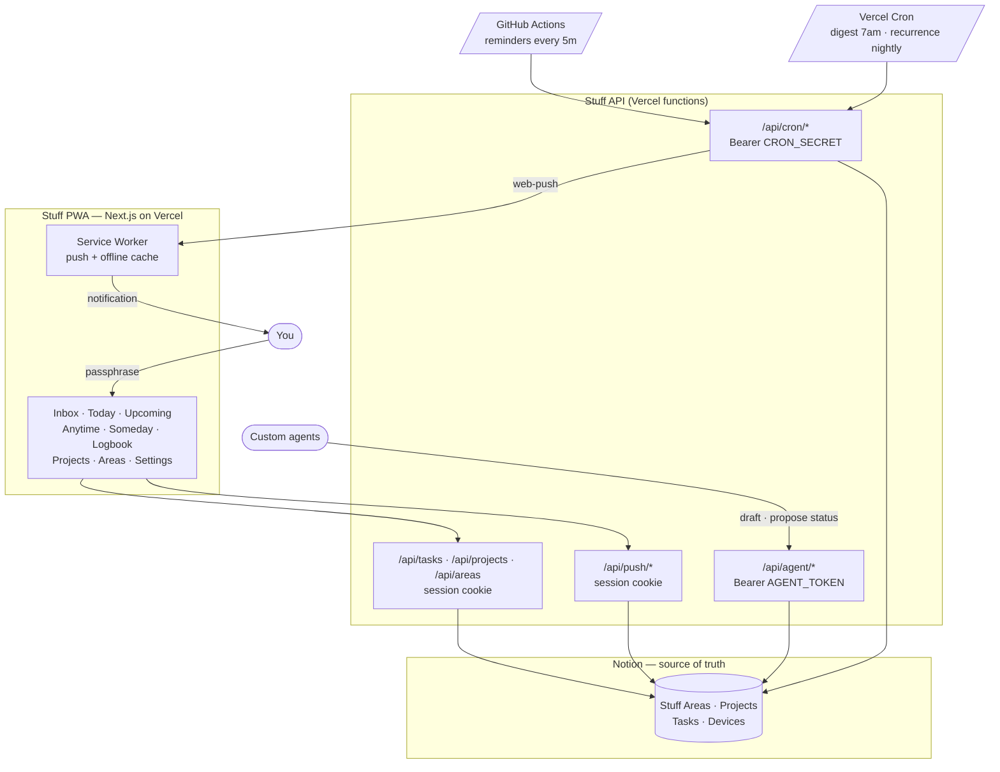

# Stuff

A fast, Notion-backed task manager. Things-style methodology, agent-friendly.

## Why

The Notion mobile app isn't built for fast task capture and triage. Stuff is a thin, fast client over the Notion API — installable as a PWA on iOS today, native SwiftUI later. Notion remains the source of truth, so AI agents can read and write the same tasks I do.

## Layout

```
apps/
  web/        Next.js 15 PWA + API routes (proxy + cron)
packages/
  shared/     zod Task schema, RRULE helpers, push payload types
  notion/     Notion DB schema-as-code, typed client, migration script
docs/         Productivity guide, ADRs
```

## Architecture

Notion holds the data; Stuff is the thin, fast surface over it. Three different writers (you, agents, scheduled jobs) hit the same four databases, each with its own auth.



### The four Notion databases

| DB | What lives in it |
|---|---|
| **Stuff Areas** | Ongoing standards of maintenance (Career, Health, …). |
| **Stuff Projects** | Outcomes with a deadline. Belongs to one Area. |
| **Stuff Tasks** | The unit of work. Belongs to a Project or Area. Carries `Status`, `When`, `Deadline`, `Recurrence`, plus agent fields (`Source`, `Proposed Status`, `Agent Notes`, `Agent Touched At`). |
| **Stuff Devices** | One row per browser/device push subscription (endpoint + VAPID keys). Managed by the app; not edited by hand. |

### Three writer surfaces

- **You — session cookie.** Sign in with `AUTH_PASSPHRASE`. All `/api/tasks`, `/api/projects`, `/api/areas` calls and the Settings page use this.
- **Agents — `AGENT_TOKEN` bearer.** `/api/agent/*` lets custom agents draft tasks (server forces `Status="Inbox"`, `Source="Agent"`, stamps `Agent Touched At`) and *propose* status changes via `Proposed Status`. Agents **never** write `Status` directly. A banner in the app surfaces every proposal with Confirm / Reject.
- **Cron — `CRON_SECRET` bearer.** Two schedulers pinging three `/api/cron/*` routes. **GitHub Actions** runs `reminders` every 5 min (Vercel Hobby caps cron at daily, so the sub-daily one lives in `.github/workflows/reminders.yml`; start-time + deadline warnings, idempotent via `Last Reminded At`). **Vercel Cron** runs the daily two: `morning-digest` (Today/Inbox/overdue counts in `USER_TZ`) and `recurrence` (spawns the next occurrence of recurring Done tasks, deduped via `External ID = recurrence:<parentId>:<date>`). See `docs/scheduling.md` for setup.

### Push pipeline

`/settings` → request permission → `pushManager.subscribe` with the server's VAPID public key → POST the subscription to `/api/push/subscribe` → it lands in **Stuff Devices**. Cron broadcasts via `web-push`; 404/410 endpoints get pruned. The service worker handles the push event, shows the notification, and on click focuses an existing tab (or opens a new one) at the payload URL.

## Getting started

```bash
pnpm install
cp .env.example .env.local   # fill in NOTION_TOKEN, AUTH_*, VAPID_*, CRON_SECRET, AGENT_TOKEN
pnpm --filter @stuff/notion run init    # creates the four DBs under NOTION_PARENT_PAGE_ID
pnpm dev
```

## Milestones

- **M0** — schema ✅
- **M1** — read-only PWA + auth ✅
- **M2** — write/edit ✅
- **M3** — notifications + Vercel Cron ✅
- **M4** — agent integration ✅
- **M5** — native SwiftUI (later)

See [`docs/guide.md`](docs/guide.md) for the productivity guide (capture / daily review / weekly review / agent patterns) and the agent API reference.
